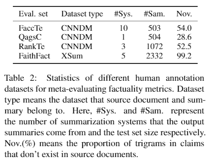

# AdvFact
The directory contains trained models, diagnostic test sets and augmented training data for paper **Factuality Checker is not Faithful: Adversarial Meta-evaluation of Factuality in Summarization**

## Factuality metrics
Six representative factuality checkers included in the paper are as follows: 
* **FactCC:** the codes and original FactCC can be downloaded from [https://github.com/salesforce/factCC](https://github.com/salesforce/factCC). The four FactCCs trained with sub sampling and augmented data can be downloaded from [here](https://drive.google.com/drive/u/1/folders/1wg9jHrO90_t85ymRFBi7l6o4U7_fij_s).
* **Dae:** the codes and trained model can be downloaded from [https://github.com/tagoyal/dae-factuality](https://github.com/tagoyal/dae-factuality).
* **BertMnli, RobertaMnli, ElectraMnli:** the codes are included in [baseline](./baseline) and the trained models can be downloaded [here](https://drive.google.com/drive/u/1/folders/1wg9jHrO90_t85ymRFBi7l6o4U7_fij_s).
* **Feqa:** the codes and trained model can be downloaded from [https://github.com/esdurmus/feqa](https://github.com/esdurmus/feqa).


## Adversarial transformation codes
The codes of adversarial transformations are in the directory of [adversarial transformation](./adversarial transformation). To make adversarial transformation, please run the following commands:
```python
CUDA_VISIBLE_DEVICES=0 python main.py -path DATA_PATH -save_dir SAVE_DIR -trans_type all
```
Change the DATA_PATH and SAVE_DIR to your own data path and save directory.

## Diagnostic evaluation set
Six base evaluation datasets and four adversarial transformations are included in the paper.
* **Base evaluation datasets**
    - **DocAsClaim:** Document sentence as claim.
    - **RefAsClaim:** Reference summary sentence as claim.
    - **FaccTe:** Human annotated evaluation set from [Evaluating the Factual Consistency of Abstractive Text Summarization](https://www.aclweb.org/anthology/2020.emnlp-main.750.pdf)
    - **QagsC:** Human annotated evaluation set from [Asking and Answering Questions to Evaluate the Factual Consistency of Summaries](https://www.aclweb.org/anthology/2020.acl-main.450.pdf)
    - **RankTe:** Human annotated evaluation set from [Ranking Generated Summaries by Correctness: An Interesting but Challenging Application for Natural Language Inference](https://www.aclweb.org/anthology/P19-1213.pdf)
    - **FaithFact:** Human annotated evaluation set from [On Faithfulness and Factuality in Abstractive Summarization](https://www.aclweb.org/anthology/2020.acl-main.173.pdf)
* **Adversarial transformation**
    - Antonym Substitution
    - Numerical Editing
    - Entity Replacement
    - Syntactic Pruning



Every adversarial transformation can be performed on the six base evaluation datasets, thus results in 24 diagnostic evaluation set. All base evaluation datasets and diagnostic evaluation sets can be found [here](https://drive.google.com/drive/u/1/folders/1inYZnSkxj1JfgHHpR2OjfNXpT-SFc24p).

## Error analysis samples
The 140 samples that are misclassified by the FactCC are in the directory: [data](./data)

## Augmented training data
The augmented training data can be downloaded [here](https://drive.google.com/drive/u/1/folders/1lrqfrubEhRECjHM9SooeGABJ4-FW5bAR).


